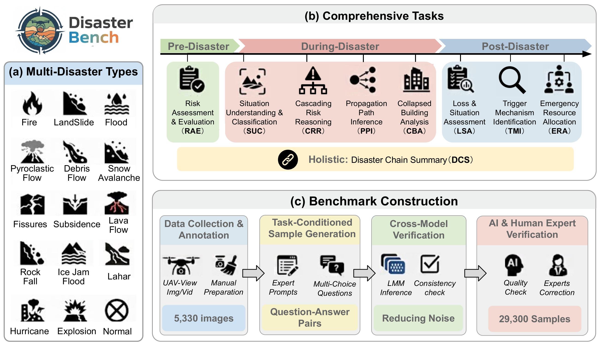

# DisasterBench-A-Multimodal-Benchmark-for-UAV-Based-Disaster-Response-in-Complex-Environments

This is the official repository for the paper: **DisasterBench: A Multimodal Benchmark for UAV-Based Disaster Response in Complex Environments**.

## Overview

## Highlights
- **DisasterBench**: a multimodal benchmark for UAV-based disaster response reasoning
- **Complex task taxonomy** spanning pre-, during-, and post-disaster stages
- **DisasterVL**: a lightweight vision-language model for disaster reasoning
- **Curriculum-guided training** enables token-efficient disaster reasoning

## Dataset Structure

The dataset is organized within the `data/` directory. At present, we provide the **test set** for evaluation purposes. The `train` and `val` directories are initialized but kept empty, as the training and validation sets are not publicly released at this stage.

- 📂 `data/`
  - 📂 `test/` [test](./data/test/)
  - 📂 `train/
  - 📂 `val/

